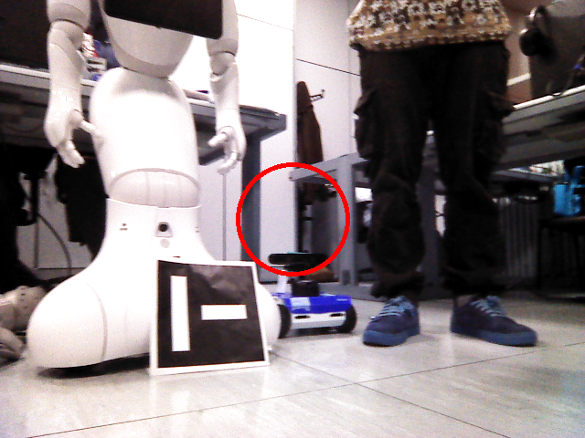
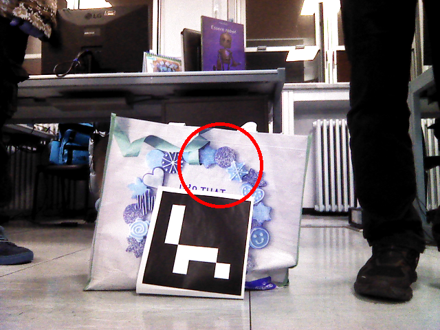

# Aruco detection and angular visual servoing in Gazebo & ROS 2, and on Rosbot hardware

**Assignment 1 — Experimental Robotics Lab**  
Authors: Gian Marco Balia, Christian Negri Ravera, Francesca Amato, Filippo Salterini, Arian Tavousi, Milad Rabiei

<details>
<summary>Short description: </summary>
Spawn a robot in a Gazebo world with 5 ArUco markers placed in a circle. The system detects all markers, then, in ascending order of marker ID, rotates the robot to center each marker in the image (visual servoing phase), publishes an annotated image (with a circle around the marker) on a topic and saves the final frames. 
</details>

<table>
  <tr>
    <td>Gazebo Run</td>
     <td>Rosbot Run</td>
  </tr>
  <tr>
    <td></td>
    <td></td>
  </tr>
 </table>

---

## Description and features
- Gazebo simulation with a robot and 5 ArUco-marked boxes placed in a circular arrangement.
- ArUco detection pipeline (via `ros_aruco_opencv` package).
- `aruco_detections.py` node:
  - searches for all 5 marker IDs are detected and records their transformations w.r.t the world,
  - sorts IDs and selects the lowest remaining ID as target,
  - rotates the robot to center the marker in the camera image (angular visual servoing),
  - when centered, draws a circle on the image, publishes it on `/final_marker_image` and saves to disk,
  - repeats for each marker in ascending order until done.


### Workflow and Operational Logic

The node implements a two‑stage behavior: **global detection** followed
by **marker‑by‑marker centering**.

#### 1. Detection Phase

-   The node subscribes to `/aruco_detections` and continuously rotates
    the robot by publishing a fixed angular velocity.
-   Each time an ArUco marker is detected, its transform relative to the
    robot's base frame is retrieved from TF.
-   Marker IDs are recorded until **five unique IDs** have been
    observed.
-   Once five markers are collected, the node sorts their IDs and
    switches to the **centering phase**, starting with the first marker.

#### 2. Centering Phase (Global Alignment)

-   The node selects the current target marker (e.g., `marker_12`) and
    looks up its transform relative to the robot base.
-   It computes the angular error using `atan2(y, x)` in the robot
    frame.
-   A proportional controller applies angular velocity to rotate the
    robot until the marker is approximately centered.
-   When the marker becomes visible in the image stream, the node
    switches to **local optimization**.

#### 3. Local Optimization (Visual Servoing)

-   The node uses an image‑derived variable (`local_z`) to refine the
    centering with a more direct visual cue.
-   When `|local_z|` falls below a threshold, the marker is considered
    centered precisely.

#### 4. Image Capture

-   Upon successful centering, the node:
    -   Retrieves the last received image,
    -   Draws a circle around the image center,
    -   Saves the processed image to the workspace resources directory,
    -   Publishes the modified image on `/final_marker_image`.

#### 5. Progression Through All Markers

-   After finishing one marker, the node proceeds to the next ID in the
    sorted list.
-   When all markers have been centered and captured, the node enters
    the `done` state and stops issuing velocity commands.

#### Parameters & tuning

- `Kp = 1.0`
- `max_angular = 1.0`
- `threshold = 0.1 rad`
- `timer: 0.01s`


---

## Prerequisites
<details>
 <summary>Details</summary>

OS: Ubuntu (tested on Ubuntu 22 for ROS 2 Humble and Ubuntu 24 for ROS 2 Jazzy).

ROS 2: Humble (works) and Jazzy (works) — you may need to clone the correct branch of ros_aruco_opencv for your distro.

Gazebo Harmonic is used — confirm the exact Gazebo version matching the ROS 2 distro (although Harmonic works on both ROS versions in this assignment).

Python: system Python3 (version used by ROS 2 distro; typically 3.10+).

System tools: colcon, vcstool (python3-vcstool), development libraries for ROS2 packages.
</details>


## Installation (bundle workspace)

<details>

<summary>Details</summary>

This repository is provided as a bundle (multiple packages + repos files). The recommended workflow is to create a workspace and use vcs to import the referenced repositories.

Clone the assignment bundle (example)

```bash
sudo apt-get update
sudo apt install -y \
  python3-pip ros-dev-tools\
  ros-$ROS_DISTRO-control-msgs \
  ros-$ROS_DISTRO-control-toolbox \
  ros-$ROS_DISTRO-ros2-control \
  ros-$ROS_DISTRO-ros2-controllers \
  ros-$ROS_DISTRO-joy \
  ros-$ROS_DISTRO-teleop-twist-joy \
  ros-$ROS_DISTRO-moveit \
  ros-$ROS_DISTRO-moveit-ros-planning \
  ros-$ROS_DISTRO-moveit-ros-move-group \
  ros-$ROS_DISTRO-moveit-core \
  ros-$ROS_DISTRO-moveit-plugins \
  ros-$ROS_DISTRO-tf2 \
  ros-$ROS_DISTRO-tf2-ros \
  ros-$ROS_DISTRO-tf2-geometry-msgs \
  ros-$ROS_DISTRO-xacro \
  ros-$ROS_DISTRO-urdf\
  ros-$ROS_DISTRO-moveit-servo
sudo apt update

sudo apt-get ros-$RIS_DISTRO-control-msgs ros-$RIS_DISTRO-control-toolbox ros-$RIS_DISTRO-moveit-msgs
sudo apt update
sudo apt install python3-vcstool

git clone https://github.com/ExpRobLab/assignment1_bundle.git assignment1_ws
cd assignment1_ws
mkdir src
```

Import repositories (if the bundle supplies .repos files inside the cloned repo)
from within your workspace:

```bash
vcs import src < assignment1_https.repos
```

or with SSH:

```bash
vcs import src < assignment1_ssh.repos
```

If you want to use also the simulation of the Husarion Rosbot:

```bash
sudo apt-get update
sudo apt-get install -y python3-pip ros-dev-tools

export HUSARION_ROS_BUILD_TYPE=simulation
vcs import src < src/rosbot_ros/rosbot/rosbot_${HUSARION_ROS_BUILD_TYPE}.repos

export PIP_BREAK_SYSTEM_PACKAGES=1
sudo rosdep init
rosdep update --rosdistro $ROS_DISTRO
rosdep install colcon build --symlink-install --packages-up-to
-i --from-path src --rosdistro $ROS_DISTRO -y

colcon build --symlink-install --packages-up-to rosbot --cmake-args -DCMAKE_BUILD_TYPE=Release
```

build

```bash
colcon build --symlink-install --packages-up-to assignment1 bme_gazebo_basics worlds_manager aruco_opencv_msgs aruco_opencv

source install/local_setup.bash
```


NOTE: The repo references ros_aruco_opencv external package. Make sure that package is available in your src (installed through `vcs`) and that you check-out (or initially clone in vs) a branch compatible with your ROS 2 distro if necessary. The package maintainer may have a branch per ROS distro. If using Humble or Jazzy, check out to the matching branch.

</details>

## Launchfiles

There are several choices to launch:

1. MoGi bot with 2 wheels with differential driver control:

```bash
ros2 launch assignment1 assignment_2wheels.launch.py
```
2. MoGi bot with 4 wheels with skid steer control:

```bash
ros2 launch assignment1 assignment_4wheels_skid_steer.launch.py
```
3. MoGi bot with 4 wheels with mecanum drive controller:

```bash
ros2 launch assignment1 assignment_4wheels_mecanum.launch.py
```

4. Husarion Rosbot with 4 wheels with mecanum drive controller:

```bash
ros2 launch assignment1 assignment_husarion_sim.launch.py
```

5. Real Husarion Rosbot:

```bash
export ROS_DOMAIN_ID=<id_rosbot>
ros2 launch assignment1 assignment_husarion.launch.py
```


## Output files, RQt graphs & screenshots

- Output Images
<table>
  <tr>
    <td>Box 1</td>
    <td>Box 2</td>
    <td>Box 3</td>
  </tr>
  <tr>
    <td></td>
    <td></td>
    <td></td>
  </tr>
  <tr>
    <td></td>
    <td></td>
    <td></td>
  </tr>
 </table>

- RQT Graph
<table>
  <tr>
    <td></td>
  </tr>
 </table>

